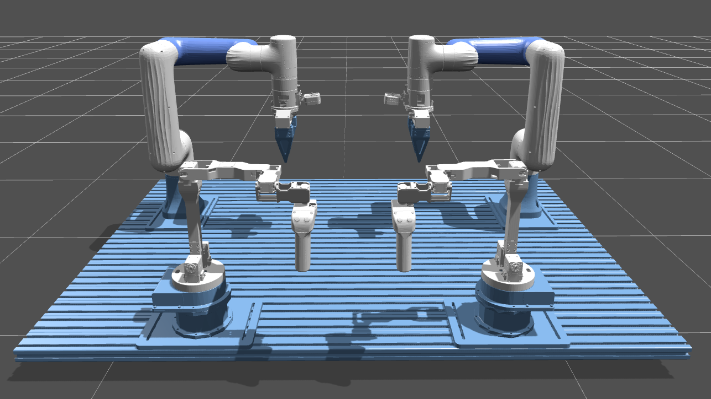
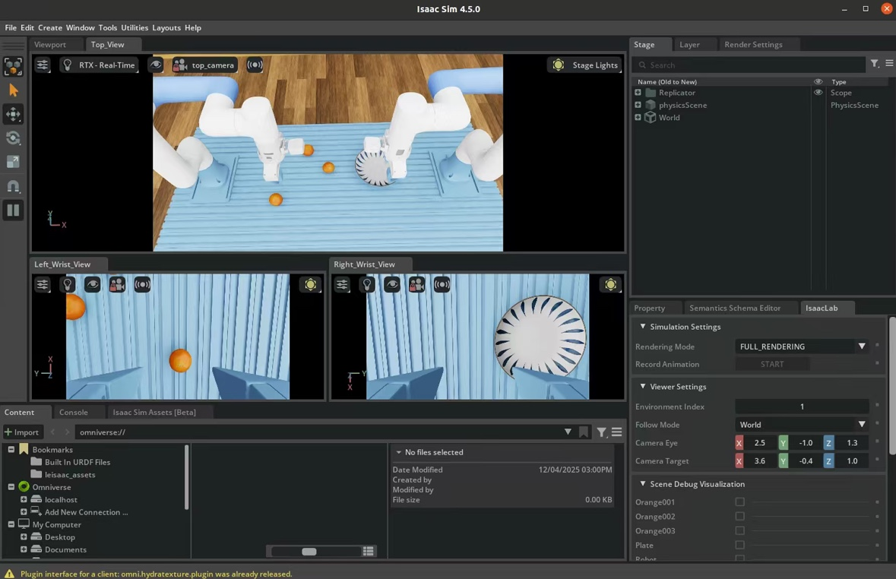

# X-Trainer-LeIsaac

[English](README.md) | [中文](README.zh.md)


[](CHANGELOG.md)

本项目基于 **Isaac Lab (LeIsaac)** 框架，提供了一套面向 **X-Trainer 双臂机器人** 的完整工作流：仿真、键盘遥操作、以及由真实 Leader 设备驱动的数据采集。

系统包含双臂协同 Lift Cube 任务、三视角 RGB 视觉感知，并可在 30Hz 下高精度记录数据，适用于 VLA（Vision-Language-Action）模型训练。

采集的数据可直接在 **LeRobot** 框架中训练；训练后的模型同样能在本环境内进行异步推理评估。

如需了解整体技术路线、模块关系与算法说明，请参见 `docs/TECHNICAL_OVERVIEW.zh.md`。

面向销售与技术支持的演示与培训手册，请参见 `docs/TRAINING_SALES_SUPPORT.zh.md`。

---

## 功能亮点

* **双臂仿真场景**：完整导入 X-Trainer 机器人 URDF，并调优碰撞/动力学参数。
* **多模态感知**：集成 **三视角 RGB 相机**（左腕、右腕、俯视），分辨率 640×480，FOV 69°，与 Realsense D435i 一致。
* **双臂键盘控制 (`BiKeyboard`)**：通过增量关节控制方式，独立控制 14 个自由度。
* **真实机器人遥操作 (`XTrainerLeader`)**：从真实 X-Trainer Leader 读取 14 维关节角，通过 USB 串口实时驱动仿真 16 维动作，实现数字孪生。
* **VR 遥操作 (`XTrainerVR`)**：基于 WebXR 的 `XLeVR` 轻量化网页，可在 Quest / PICO 头显浏览器中读取 6DoF 姿态与扳机按键，按 `B` 自动标定原点并映射为 16 维仿真动作。
* **高质量数据采集**：使用 `Decimation=2`、`Step_Hz=30` 保证严格 30Hz 帧同步；以 HDF5 存储对齐的图像/关节数据，可直接转换为 LeRobot 数据。
* **模型可视化与评估**：通过服务端-客户端异步推理接口，与 LeRobot 项目无缝交互，方便可视化验证。

---

##  安装

请先从 Hugging Face 下载所需的 [USD 资产](https://huggingface.co/dstx123/xtrainer-leisaac/tree/main) 并放入 `assets` 目录。此外我们提供 15 个示例数据集（`lift_cube.hdf5`），可用于 ACT 模型训练。

### 使用 Anaconda 安装

1. 确保已安装 **Isaac Sim** 与 **Isaac Lab**。建议参考 [LeIsaac 项目文档](https://lightwheelai.github.io/leisaac/docs/getting_started/installation)，按需配置。已验证 **Isaac Sim 4.5** 可正常工作。
2. 在安装 Isaac Lab 后，执行：

```bash
conda activate leisaac
pip install -e source/leisaac
```

### （可选）使用 Docker 安装

1. 构建镜像：

```bash
git clone https://github.com/dstx123/xtrainer_leisaac.git
cd docker
docker build --network=host -t xtrainer-leisaac:v1 .
```

2. 修改 `start_docker.sh` 中的代码路径映射，例如 `-v /home/xtrainer_leisaac:/workspace/xtrainer_leisaac:rw`。
3. 创建容器：

```bash
./create_docker.sh
```

4. 之后可使用：

```bash
./start_docker.sh
```

5. 验证 IsaacLab：

```bash
cd /workspace/isaaclab
./isaaclab.sh -p scripts/tutorials/01_assets/run_rigid_object.py
```

6. 在容器内安装本项目：

```bash
cd xtrainer_leisaac
pip install -e source/leisaac
```

### 真实机器人遥操作注意事项

项目中已集成 [dobot_xtrainer](https://github.com/robotdexterity/dobot_xtrainer)（路径：`source/leisaac/leisaac/xtrainer_utils`），可直接使用真实 X-Trainer Leader 控制仿真 Follower，实现数据采集。

---

## 使用方法

### 1. 键盘遥操作

```bash
python scripts/environments/teleoperation/teleop_se3_agent.py \
    --task=LeIsaac-XTrainer-PickCube-v0 \
    --teleop_device=bi_keyboard \
    --num_envs=1 \
    --device=cuda \
    --enable_cameras \
    --multi_view
```

#### ⌨️ 键位说明（`BiKeyboard`）

布局按左右手分区：左手控制左臂，右手控制右臂；按住动作键移动，松开停止；按住 `Shift` + 键实现反向。

| 关节 | 左臂键位 | 右臂键位 | 说明 |
| :--- | :---: | :---: | :--- |
| **J1** | `Q` | `U` | 按住移动，松开停止 |
| **J2** | `W` | `I` | — |
| **J3** | `E` | `O` | — |
| **J4** | `A` | `J` | — |
| **J5** | `S` | `K` | — |
| **J6** | `D` | `L` | — |
| **夹爪** | **`G`** | **`H`** | **按住闭合，松开张开** |

系统控制键：

* `B`：开始控制
* `R`：失败并重置
* `N`：成功并重置

### 2. 真实 Leader 遥操作

#### 第一步：初始化串口配置

```bash
python scripts/find_port.py
```

#### 第二步：零点标定

将 Leader 调整至初始姿态（见下图），运行：

```bash
python scripts/get_offset.py
```



#### 第三步：开始遥操作

```bash
python scripts/environments/teleoperation/teleop_se3_agent.py \
    --task=LeIsaac-XTrainer-PickCube-v0 \
    --teleop_device=xtrainerleader \
    --num_envs=1 \
    --device=cuda \
    --enable_cameras \
    --multi_view
```

### 3. VR 遥操作（`XTrainerVR`）

基于 `source/leisaac/leisaac/xtrainer_utils/XLeVR/` 中的 WebXR 服务，可直接使用 Quest 3 / PICO 4 等头显遥操作仿真双臂。

1. **安装依赖（首次使用）**

```bash
pip install -r source/leisaac/leisaac/xtrainer_utils/XLeVR/requirements.txt
```

2. **启动遥操作脚本**

```bash
python scripts/environments/teleoperation/teleop_se3_agent.py \
    --task=LeIsaac-XTrainer-PickCube-v0 \
    --teleop_device=xtrainer_vr \
    --num_envs=1 \
    --device=cuda \
    --enable_cameras \
    --multi_view
```

如只持有右手柄，可附加 `--left_disabled` 关闭左臂映射。

3. **在头显浏览器连接**

    * 头显与工作站保持同一局域网。
    * 脚本启动后终端会打印访问地址，例如 `https://192.168.1.23:8443`。
    * 首次访问需在 Quest Browser / PICO 浏览器中信任自签名证书，随后即可看到 `XLeVR` Web UI。

4. **控制逻辑**

    * `右手 B`：开始控制并自动记录当前手柄姿态为零点。
    * `左手 X`：任务失败并重置（触发 `R` 回调）。
    * `左手 Y`：任务成功并重置（触发 `N` 回调）。
    * 扳机（Trigger）对应夹爪闭合程度，松开即张开。

如需自定义端口或证书，可编辑同目录下的 `config.yaml` / `cert.pem` / `key.pem`。

### 4. 数据转换

采集完成后，可将 HDF5 转为 LeRobot 数据格式：

```bash
python scripts/convert/isaaclab2lerobot_xtrainer.py
```

推荐单独创建 `lerobot` Conda 环境用于训练。

### 5. 可视化评估

训练好模型后，可在本项目中进行推理评估。

**在 LeRobot 环境启动服务端：**

```bash
conda activate lerobot
cd ~/lerobot
python -m lerobot.async_inference.policy_server \
     --host=127.0.0.1 \
     --port=5555 \
     --fps=30 
```

**在 LeIsaac 环境启动客户端：**

```bash
conda activate leisaac
cd ~/leisaac
python scripts/evaluation/policy_inference.py \
    --task=LeIsaac-XTrainer-PickCube-v0 \
    --eval_rounds=10 \
    --policy_type=xtrainer_act \
    --policy_host=localhost \
    --policy_port=5555 \
    --policy_timeout_ms=5000 \
    --policy_action_horizon=16 \
    --policy_language_instruction="Grab cube and place into plate" \
    --device=cuda \
    --enable_cameras \
    --policy_checkpoint_path="./checkpoints/last/pretrained_model"
```

**ACT 数据采集：**


**ACT 模型演示：**


**多视角相机画面（左腕 / 右腕 / 俯视）：**



### 即将支持

| 头显 | 状态 |
| :-- | :-- |
| Quest 3 | ✅ 已支持 |
| PICO 4 | ✅ 已支持 |
| Vision Pro | 🔄 开发中 |

---

## 贡献与支持

欢迎提交 PR 与 Issue。建议流程：

1. Fork 仓库并创建特性分支；
2. 遵循现有代码风格，必要时补充测试或 Demo；
3. 在 PR 中说明动机与测试结果。

如需反馈 bug、功能请求或寻求帮助，可直接在 GitHub Issue 中留言。

## 鸣谢 / 引用

本项目基于以下开源工作构建：

* [Isaac Lab / LeIsaac](https://github.com/lightwheelai/leisaac)
* [LeRobot](https://github.com/huggingface/lerobot)
* [dobot_xtrainer](https://github.com/robotdexterity/dobot_xtrainer)

如在学术工作中使用这些组件，请按照相应项目的引用要求引用。

## 许可证

本仓库遵循 [BSD-3-Clause License](LICENSE) 授权。
